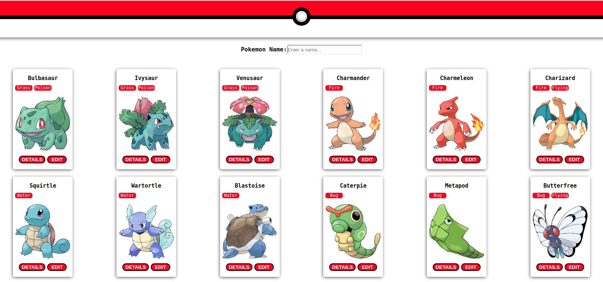

# Prerequisites

1 - Node

2 - Clone this project and run on your machine (the project server is down):

[graphql-pokemon](https://github.com/lucasbento/graphql-pokemon.git)

After that you will be able to run this project

# To run this project

1 - Download the project

2 - npm install

3 - npm run start

4 - If you want to test run npm run test

5 - If you want to see the coverage of the tests run npm run test:coverage

# Project image

